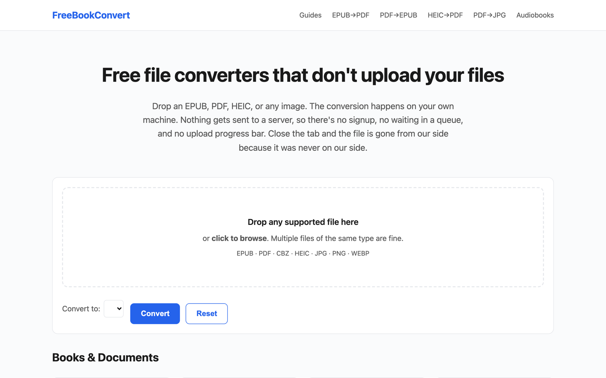
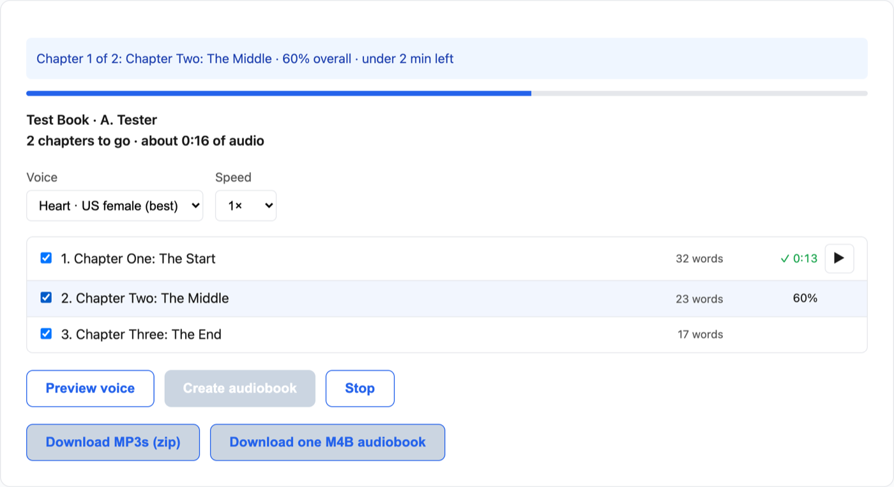

<p align="center">
  <a href="https://freebookconvert.com"><strong>🔗 Use it now at freebookconvert.com →</strong></a>
</p>

# FreeBookConvert

**Free file converters that never upload your files.**
Every conversion runs inside your browser tab with JavaScript and WebAssembly.
There is no backend: the site is plain static files, and your files never touch
a server. You can check this yourself: load a page, turn off Wi-Fi, and convert.

<p align="center">
  <a href="https://freebookconvert.com"></a>
</p>

## What it does

| Category | Tools |
|---|---|
| Ebooks | [EPUB → PDF](https://freebookconvert.com/pages/epub-to-pdf) · [PDF → EPUB](https://freebookconvert.com/pages/pdf-to-epub) ([with chapters](https://freebookconvert.com/pages/pdf-to-epub-with-chapters)) · [EPUB → TXT](https://freebookconvert.com/pages/epub-to-txt) · [CBZ → PDF](https://freebookconvert.com/pages/cbz-to-pdf) · [JPG → CBZ](https://freebookconvert.com/pages/jpg-to-cbz) |
| E-readers | [PDF for Kindle Scribe](https://freebookconvert.com/pages/pdf-for-kindle-scribe) · [PDF for Kobo](https://freebookconvert.com/pages/pdf-for-kobo) · [PDF for Boox](https://freebookconvert.com/pages/pdf-for-boox) · [PDF for reMarkable](https://freebookconvert.com/pages/pdf-for-remarkable) |
| PDF | [Merge PDF](https://freebookconvert.com/pages/merge-pdf) · [PDF → JPG](https://freebookconvert.com/pages/pdf-to-jpg) · [PDF → PNG](https://freebookconvert.com/pages/pdf-to-png) · [Images → PDF](https://freebookconvert.com/pages/images-to-pdf) · [JPG → PDF](https://freebookconvert.com/pages/jpg-to-pdf) · [PNG → PDF](https://freebookconvert.com/pages/png-to-pdf) · [WEBP → PDF](https://freebookconvert.com/pages/webp-to-pdf) |
| OCR | [PDF OCR](https://freebookconvert.com/pages/pdf-ocr) · [Searchable PDF](https://freebookconvert.com/pages/searchable-pdf) · [Scanned PDF → text](https://freebookconvert.com/pages/scanned-pdf-to-text) · [Image → text](https://freebookconvert.com/pages/image-to-text) · [Recipe screenshot → text](https://freebookconvert.com/pages/recipe-screenshot-to-text) |
| Images | [HEIC → JPG](https://freebookconvert.com/pages/heic-to-jpg) · [HEIC → PNG](https://freebookconvert.com/pages/heic-to-png) · [HEIC → PDF](https://freebookconvert.com/pages/heic-to-pdf) · [JPG → PNG](https://freebookconvert.com/pages/jpg-to-png) · [PNG → JPG](https://freebookconvert.com/pages/png-to-jpg) · [JPG → WEBP](https://freebookconvert.com/pages/jpg-to-webp) · [PNG → WEBP](https://freebookconvert.com/pages/png-to-webp) · [WEBP → JPG](https://freebookconvert.com/pages/webp-to-jpg) · [WEBP → PNG](https://freebookconvert.com/pages/webp-to-png) |
| Use cases | [HEIC → JPG on Chromebook](https://freebookconvert.com/pages/heic-to-jpg-chromebook) · [iPhone screenshots → PDF](https://freebookconvert.com/pages/screenshots-to-pdf-iphone) · [Android screenshots → PDF](https://freebookconvert.com/pages/screenshots-to-pdf-android) · [PNG for Cricut](https://freebookconvert.com/pages/png-for-cricut) · [JPG → PNG for sublimation](https://freebookconvert.com/pages/jpg-to-png-sublimation) |
| Audiobooks | [EPUB → audiobook](https://freebookconvert.com/pages/epub-to-audiobook) · [PDF → audiobook](https://freebookconvert.com/pages/pdf-to-audiobook) · [Read Aloud](https://freebookconvert.com/pages/read-aloud) · [MP3 → M4B](https://freebookconvert.com/pages/mp3-to-m4b) · [M4B → MP3](https://freebookconvert.com/pages/m4b-to-mp3) |

It's also an installable app that works offline and can open files from the
OS "Open with" menu. It follows your system's dark mode, and on desktop you can
paste a screenshot (Ctrl/⌘+V) straight into any image tool.

Found a file that won't convert? Every error message has a **Report this
problem** link that pre-fills an issue here. Want a new tool?
[Suggest one](https://github.com/andrewnakas/freebookconvert/issues/new?template=tool-request.yml).

### Private AI audiobooks

<p align="center">
  <a href="https://freebookconvert.com/pages/epub-to-audiobook"></a>
</p>

[EPUB to audiobook](https://freebookconvert.com/pages/epub-to-audiobook) narrates a DRM-free ebook with
an open neural voice (Kokoro-82M) that runs on your own CPU. Finished chapters
are saved as it goes, so you can stop and resume, and export as MP3s or one
chaptered M4B.

**Guides:** [What is an M4B?](https://freebookconvert.com/guides/what-is-m4b) · [How to turn an ebook into an audiobook](https://freebookconvert.com/guides/make-audiobook-from-ebook) · [What is an EPUB?](https://freebookconvert.com/guides/what-is-epub) · [HEIC explained](https://freebookconvert.com/guides/heic-explained) · [How OCR works](https://freebookconvert.com/guides/how-ocr-works) · [Sideload ebooks to an e-reader](https://freebookconvert.com/guides/sideload-ebooks-to-ereader) · [all guides](https://freebookconvert.com/guides/)

## How it works

| Tool | Libraries |
|---|---|
| EPUB ⇄ PDF, CBZ, merge | [JSZip](https://stuk.github.io/jszip/), [pdf-lib](https://pdf-lib.js.org/) |
| PDF rendering and text | [pdf.js](https://mozilla.github.io/pdf.js/) |
| HEIC | [heic-to](https://github.com/hoppergee/heic-to) (libheif) |
| OCR | [Tesseract.js](https://tesseract.projectnaptha.com/) |
| M4B / MP3 | [ffmpeg.wasm](https://ffmpegwasm.netlify.app/) core, single-thread |
| Neural narration | [kokoro-js](https://github.com/hexgrad/kokoro) (Kokoro-82M, Apache 2.0) via transformers.js, MP3 via [lamejs](https://github.com/zhuker/lamejs) |
| Read Aloud | Web Speech API |

Libraries are loaded from pinned CDN versions only when a conversion starts, and
checked against SRI or SHA-384 hashes where the browser allows it.

## Run it locally

No build step and no dependencies:

```sh
git clone https://github.com/andrewnakas/freebookconvert.git
cd freebookconvert
python3 -m http.server 8080    # then open http://localhost:8080/pages/epub-to-pdf.html
```

Use `http://`, not `file://`: module workers and pdf.js need a real origin.
Pretty URLs like `/epub-to-pdf` come from `_redirects` (Cloudflare Pages), so
locally use the `/pages/*.html` paths.

## Project layout

```
index.html, 404.html   homepage (with the universal drop zone) and error page
pages/                 one HTML page per converter, plus about/privacy/terms
guides/                long-form explainers
js/common.js           shared dropzone, status, download, analytics hooks, "what next" suggestions
js/*.js                one module per converter; audio in audio-core.js, m4b.js, tts-worker.js
tools/sync.mjs         rewrites shared blocks + generates sitemap.xml and llms.txt
tools/partials/        the shared CSP, analytics, header, footer, PWA blocks
sw.js, manifest.webmanifest, js/pwa.js   installable app / offline support
```

### Shared blocks and the sitemap

The CSP, analytics/consent, header, and footer are the same on every page and
live in `tools/partials/`. Each page holds a copy between marker comments
(`<!-- @header -->` … `<!-- /@header -->`). To change one site-wide:

```sh
# edit tools/partials/<block>.html, then
node tools/sync.mjs          # rewrites every page, regenerates sitemap.xml and llms.txt
node tools/sync.mjs --check  # exits 1 if anything is out of date
```

`sitemap.xml` is generated from every page without `noindex`, with `lastmod`
taken from the last git commit that touched the file. To add a page: create the
HTML file (copy an existing one), run sync, and add a short URL to `_redirects`.

### Audio architecture

- **ffmpeg** (`js/audio-core.js`, `js/ffmpeg-worker.js`): the core JS and wasm
  are fetched from jsDelivr, checked against pinned SHA-384 hashes, and handed
  to a same-origin worker as blob URLs. The @ffmpeg/ffmpeg wrapper can't be used
  because it spawns a cross-origin worker. It's single-thread on purpose, since
  multi-thread needs COOP/COEP headers, which break third-party iframes.
- **TTS** (`js/tts-worker.js`): a module worker that loads kokoro-js and lamejs
  with dynamic `import()`. Static imports in a module worker are checked against
  the page's `worker-src` (`'self' blob:`) and fail.
- **CPU only, deliberately.** Tested 2026-09 with kokoro-js 1.2.1: WebGPU fp32
  wouldn't download, fp16 crashed the tab, and q4f16 produced unintelligible
  audio (checked by Whisper transcription). WASM q8 is correct. Please don't
  re-enable WebGPU without transcribing the output.
- Finished TTS chapters persist in IndexedDB (`fbc_tts`, 30-day expiry), and Read
  Aloud positions in localStorage. Both are documented in the privacy policy.

### Other tools

```sh
node tools/indexnow.mjs                     # tell Bing/IndexNow about pages changed in the last commit
npx -y -p playwright@1 node tools/og.mjs    # re-render assets/og/*.png social cards (needs local Chrome)
```

## Forking and self-hosting

The code is MIT licensed, so fork away. If you deploy your own copy:

- **Replace the IDs in `tools/partials/`** (the Google Analytics measurement ID,
  AdSense client ID, and Clarity ID), remove the IndexNow key file, and run
  `node tools/sync.mjs`. Otherwise your traffic is reported into this site's
  accounts.
- Replace `freebookconvert.com` in `tools/sync.mjs` (`ORIGIN`),
  `tools/indexnow.mjs`, `robots.txt`, and the canonical/OG tags.
- Please use your own name and logo. The license covers the code, not the
  FreeBookConvert name or branding.

## Contributing

Issues and pull requests are welcome, especially:

- Files that fail to convert (attach a sample if you can share it, or describe its origin).
- New converters that can run fully in the browser.
- Accessibility and mobile fixes.

Keep the one rule: **nothing may upload user files.** A change that needs a
server for conversion won't be merged.

## License

[MIT](LICENSE). Third-party libraries keep their own licenses and are loaded
from their CDNs at runtime. The ffmpeg.wasm core is built with GPL components,
and the Kokoro model is Apache 2.0.
